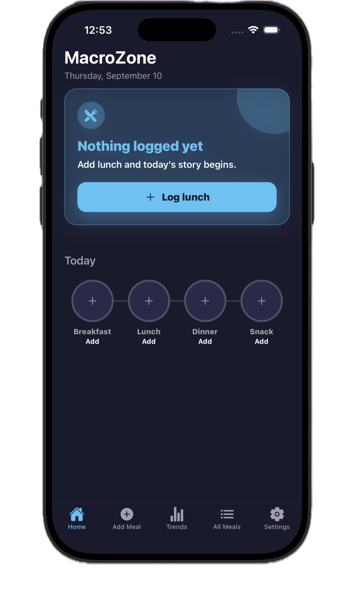
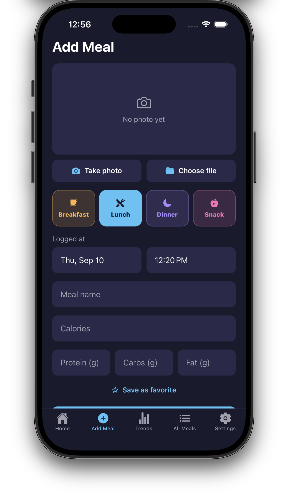
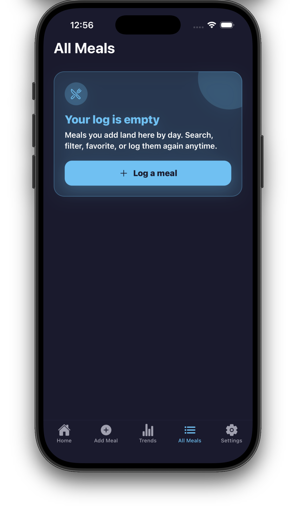
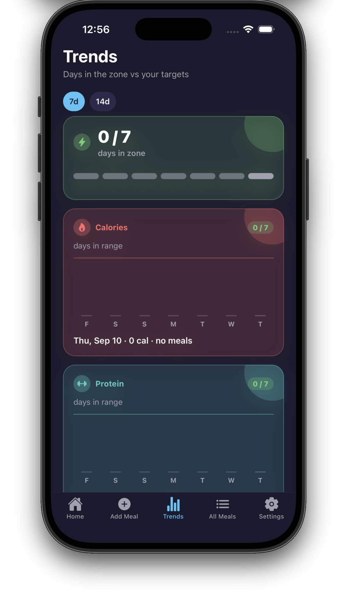
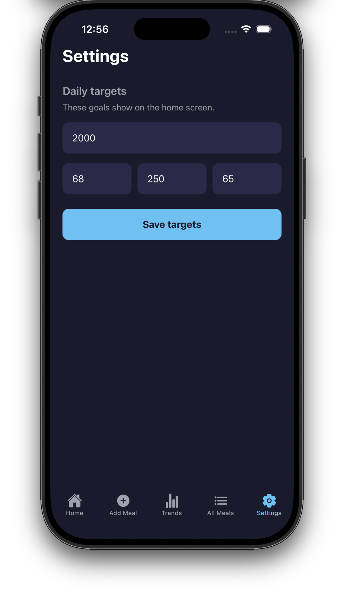

# MacroZone

A local-first macro tracker for iOS and Android. Log meals, watch your daily calories and macros against personal targets, and see whether you're **in the zone** — all without an account or cloud sync.

Built with [Expo SDK 57](https://docs.expo.dev/versions/v57.0.0/), React Native, and SQLite.

## Screenshots

### Empty states

| Home | Add meal | All meals |
| --- | --- | --- |
|  |  |  |

| Trends | Settings |
| --- | --- |
|  |  |

### With data

_Add these when you have meals logged — see [Screenshot checklist](#screenshot-checklist)._

| Home (in the zone) | Macro grid & timeline | Trends |
| --- | --- | --- |
| _coming soon_ | _coming soon_ | _coming soon_ |

| Add meal | All meals |
| --- | --- |
| _coming soon_ | _coming soon_ |

## Features

### Daily macro dashboard

- **Zone status banner** — At-a-glance feedback: empty, on track, close, in the zone, or over a target.
- **Macro grid** — Calories, protein, carbs, and fat with progress toward your daily goals. Cards briefly glow when you log a meal.
- **What fits cue** — Suggests foods that fit your remaining macros, prioritizing favorites and recent meals.
- **Day timeline** — Today's meals grouped by type (breakfast, lunch, dinner, snack) with quick actions.
- **Favorites** — Save meals as templates and log them again with one tap.
- **Log again** — Re-log past meals without re-entering macros.

### Meal logging

- Name, calories, and optional protein / carbs / fat.
- **Meal type** picker with time-aware defaults (e.g. breakfast in the morning).
- **Logged-at** date/time for backdating or correcting entries.
- **Photo** attachment via camera or photo library.
- **Save as favorite** when adding a new meal.
- Prefill the form from a saved favorite on the Add Meal tab.

### History & search

- Browse all logged meals grouped by day.
- Search by name or meal type.
- Filter by date preset (today, yesterday, last 7 days, last 30 days, custom range).
- Tap a meal to view or edit details.
- Delete individual meals or clear all history.

### Trends

- 7- or 14-day view of macro adherence.
- **Days in zone** score with per-day status dots.
- Bar charts for calories, protein, carbs, and fat vs targets.
- Tap a day for a summary, macro chips, and meal-type calorie mix.

### Settings

- Set daily calorie, protein, carb, and fat targets (defaults: 2000 cal / 150g protein / 250g carbs / 65g fat).

### Privacy & offline

- All data stays on device in a local SQLite database.
- No sign-in, analytics backend, or network dependency for core features.

## The zone

MacroZone tracks four macros: **calories**, **protein**, **carbs**, and **fat**.

You're **in the zone** when every macro is at least 90% of its target and none are over. The home banner and trends charts use this rule consistently.

| Status | Meaning |
| --- | --- |
| **Empty** | Nothing logged today |
| **On track** | Under targets with room to go |
| **Close** | Calorie progress ≥ 70%; furthest macro is almost there |
| **In the zone** | All macros ≥ 90% of target, none over |
| **Over** | At least one macro exceeds its target |

## Tech stack

| Layer | Choice |
| --- | --- |
| Framework | Expo ~57, React Native 0.86, React 19 |
| Navigation | [Expo Router](https://docs.expo.dev/router/introduction/) (file-based) |
| Database | [expo-sqlite](https://docs.expo.dev/versions/v57.0.0/sdk/sqlite/) + [Drizzle ORM](https://orm.drizzle.team/) |
| UI | React Native StyleSheet, `@expo/vector-icons`, haptics |
| Language | TypeScript (strict) |

## Project structure

```
macrozone/
├── src/
│   ├── app/                 # Expo Router screens
│   │   ├── (tabs)/          # Tab navigator (Home, Add Meal, Trends, All Meals, Settings)
│   │   └── meal/[id].tsx    # Meal detail / edit
│   ├── components/          # UI components
│   ├── db/                  # Drizzle schema and DB client
│   ├── hooks/               # Shared hooks
│   ├── storage/             # Data-access layer (meals, targets, saved meals, images)
│   ├── styles/              # Global colors and styles
│   └── utils/               # Zone logic, trends, dates, meal types, etc.
├── drizzle/                 # Generated SQL migrations
├── assets/                  # App icon and images
└── docs/screenshots/        # README screenshots (add your own)
```

Path alias: `@/*` → `./src/*`.

## Getting started

### Prerequisites

- [Node.js](https://nodejs.org/) (LTS recommended)
- [Expo Go](https://expo.dev/go) on a physical device, or Xcode / Android Studio for simulators

### Install and run

```bash
npm install
npx expo start
```

Then press `i` for iOS Simulator, `a` for Android emulator, or scan the QR code with Expo Go.

Other scripts:

```bash
npm run ios          # Start and open iOS
npm run android      # Start and open Android
npm run lint         # ESLint
npm run format       # Prettier
npm run db:generate  # Regenerate migrations after schema changes
```

### Database migrations

Schema lives in `src/db/schema.ts`. After editing it:

```bash
npm run db:generate
```

Migrations run automatically on app launch via `useMigrations` in `src/app/_layout.tsx`.

## Data model

| Table | Purpose |
| --- | --- |
| `meals` | Daily food log (name, macros, meal type, optional photo URI, logged-at timestamp) |
| `targets` | Singleton row for daily macro goals |
| `saved_meals` | Favorite meal templates (independent of the daily log) |

Meal photos are stored as local file URIs on device.

## Screenshot checklist

Save PNGs in `docs/screenshots/`. Use a simulator or device (iPhone 15 Pro or similar), light mode, and include the tab bar.

### Done

| Filename | Screen |
| --- | --- |
| `home_screen_empty.png` | Home — Start your day card |
| `add_meal_empty.png` | Add Meal — blank form |
| `all_meals_empty.png` | All Meals — no history |
| `trends_empty.png` | Trends — no data |
| `settings.png` | Settings — daily targets |

### Still to capture (with data)

| Filename | What to capture | How to set it up |
| --- | --- | --- |
| `home_in_zone.png` | Green **In the zone** banner + macro grid | Log until all macros are ≥ 90% of target, none over. |
| `home_with_meals.png` | Banner, macro cards, day timeline | Log 2–3 meals across meal types. |
| `home_close.png` | Yellow **Close** banner | ~70%+ calories logged, not fully in zone. |
| `home_what_fits.png` | **What fits** cue visible | Leave modest calorie/macro room. |
| `add_meal_filled.png` | Form with name, macros, optional photo | Partially or fully filled form. |
| `all_meals_history.png` | 3–4+ meals across 2+ days | Day headers and meal-type badges visible. |
| `all_meals_filters.png` | Search or date filter active | Type a query or pick a date preset. |
| `trends_7d.png` | 7-day charts with varied bars | Log on several past days (backdate if needed). |
| `trends_day_detail.png` | Selected day summary card | Tap a day dot; show macro chips and meal mix. |
| `meal_detail.png` | Meal edit screen | Tap a meal from All Meals. |

### Optional

| Filename | What to capture |
| --- | --- |
| `home_dark.png` | Home in system dark mode |
| `device_frame.png` | Hero shot in a device bezel |

## License

See [LICENSE](LICENSE).
